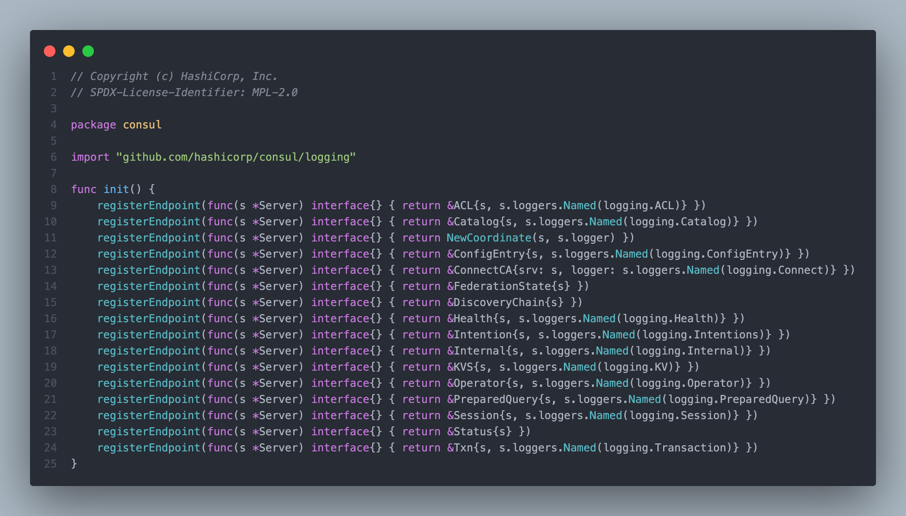
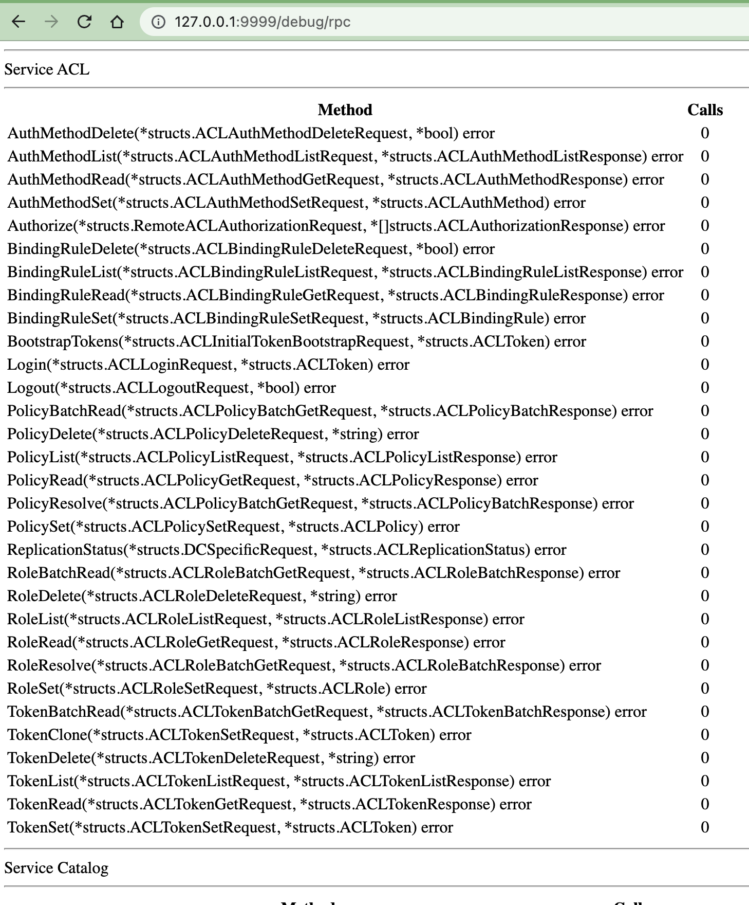

From https://github.com/hashicorp/consul/blob/main/docs/rpc/README.md

>Consul uses two RPC systems for communication between components within the cluster and with other clients such as Envoy: gRPC and Go's net/rpc package.

This is my findings on Consul usage of `net/rpc` package.

In Consul source code, RPC method calls are typically found in HTTP handlers. E.g.

```
# ag "s\.agent\.RPC" | head -n 5 | pbcopy
agent/session_endpoint.go:59:	if err := s.agent.RPC(req.Context(), "Session.Apply", &args, &out); err != nil {
agent/session_endpoint.go:86:	if err := s.agent.RPC(req.Context(), "Session.Apply", &args, &out); err != nil {
agent/session_endpoint.go:110:	if err := s.agent.RPC(req.Context(), "Session.Renew", &args, &out); err != nil {
agent/session_endpoint.go:138:	if err := s.agent.RPC(req.Context(), "Session.Get", &args, &out); err != nil {
agent/session_endpoint.go:161:	if err := s.agent.RPC(req.Context(), "Session.List", &args, &out); err != nil {

```

This is HTTP requests coming from CLI or Consul HTTP API to Consul Client, and will be forwarded to Consul Server, over port `8300`

This means the server must have exported these methods prior. How is this done?

# RPC Server register the objects



Under `init` method of `agent/consul/server_register.go`, various calls to `registerEndpoint` will be made, with factory function returning different structs.

Those structs contains multiple methods that meet the criteria of RPC exported method.

```
func (t *T) MethodName(argType T1, replyType *T2) error
```

E.g.

```go
func (a *ACL) BootstrapTokens(args *structs.ACLInitialTokenBootstrapRequest, reply *structs.ACLToken) error {

func (k *KVS) Apply(args *structs.KVSRequest, reply *bool) error {

func (c *Catalog) NodeServices(args *structs.NodeSpecificRequest, reply *structs.IndexedNodeServices) error {
```

This is the content of the `registerEndpoint`

```go
// registerEndpoint registers a new RPC endpoint factory.
func registerEndpoint(fn factory) {
	endpoints = append(endpoints, fn)
}
```

Later on, when a new Consul server is created, `setupRPC` [method](https://github.com/hashicorp/consul/blob/18a5edd23265566e3a8c0e8953c870080b36185b/agent/consul/server.go#L659-L663) will be called

That's when the structs in `endpoints` slice be registered with RPC server

```go
	for _, fn := range endpoints {
		s.rpcServer.Register(fn(s))
	}
```

That is all it takes to register methods with RPC Server. The RPC server handles the RPC calls [here](https://github.com/hashicorp/consul/blob/d935c7b466cf97da358320ec46c682af45830d69/agent/consul/rpc.go#L430)

```go
// handleConsulConn is used to service a single Consul RPC connection
func (s *Server) handleConsulConn(conn net.Conn) {
	defer conn.Close()
	rpcCodec := msgpackrpc.NewCodecFromHandle(true, true, conn, structs.MsgpackHandle)
	for {
		select {
		case <-s.shutdownCh:
			return
		default:
		}

		if err := s.rpcServer.ServeRequest(rpcCodec); err != nil {
```

Note that the `rpc` package used by Consul is a fork of `net/rpc` `github.com/hashicorp/consul-net-rpc/net/rpc`

I was curious and want to see available RPC services and methods in Consul, but the fork package remove this original file https://cs.opensource.google/go/go/+/refs/tags/go1.20.7:src/net/rpc/debug.go

So I edited the code locally, modifying `go.mod` to use my modified `consul-net-rpc`

```
module github.com/hashicorp/consul

go 1.20

replace (
	github.com/hashicorp/consul/api => ./api
	github.com/hashicorp/consul/envoyextensions => ./envoyextensions
	github.com/hashicorp/consul/proto-public => ./proto-public
	github.com/hashicorp/consul/sdk => ./sdk
	github.com/hashicorp/consul/troubleshoot => ./troubleshoot
	github.com/hashicorp/consul-net-rpc => /Users/gerard/dev/consul/consul-net-rpc
)
```

I updated Consul code to have a handler for RPC Debug path

```go
	s.rpcServer.HandleHTTP(rpc.DefaultRPCPath, rpc.DefaultDebugPath)
	l, e := net.Listen("tcp", ":9999")
	if e != nil {
		log.Fatal("listen error:", e)
	}
	go http.Serve(l, nil)
```

And this is the result when running Consul locally and go to above endpoint.



That's a good learning for this weekend! 📝
