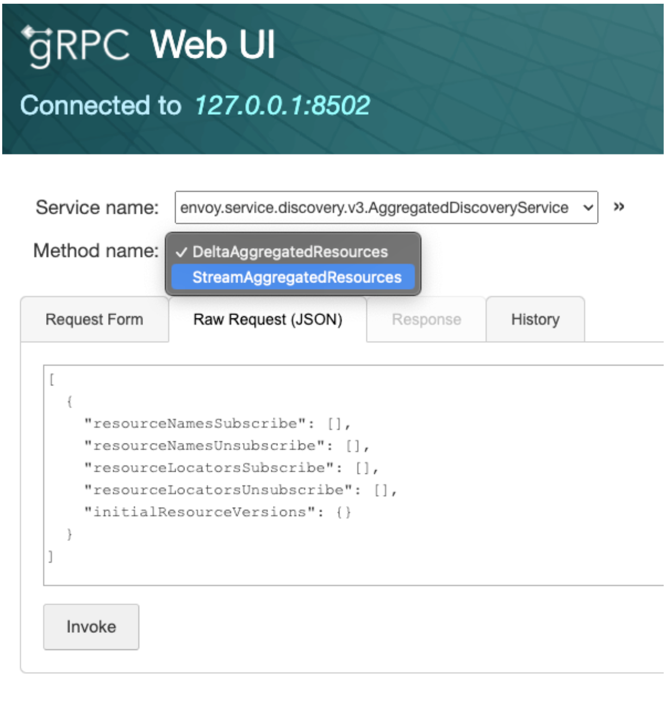

# Overview of Envoy and Consul Service Mesh

Imagine you have two applications: `frontend` and `backend`. 

For `frontend` to talk to `backend`, it needs to know `backend` address.


flowchart LR
    frontend --> backend


In your DEV environment, `backend` can simply be coupled with `frontend` in same machine and `frontend` can reach to backend by hardcoding `backend`'s address, e.g. `localhost:5000`

But things are not simple in PROD enviroment:

- `backend` is in another host
- What if there are serveral instances of `backend` that dynamically change (scaling up/down)? 
- What if you want to observe the traffic to `backend`? 
- What if traffic to `backend` must be secured?
- What if traffic to `backend` must be resilient? E.g. `frontend` must retry when failed to talk to `backend`
- What if you want to test out new version of `backend` to a subset of traffic from `frontend`?
- What if ...

These are operational problems and they get in the way of your application logic, let `frontend` talk to `backend`.

If only there's a solution that solves all of above problems, abstract them away so that your `frontend` can simply use `localhost` to talk to `backend`. Envoy to the rescue!

```
envoy /ˈɛnvɔɪ/
noun
a messenger or representative, especially one on a diplomatic mission.
```

As the name suggested, Envoy is your application representative, written in C++ from Lyft, this proxy will run alongside your application and take care of all operational problems above. Simply put, your frontend may just call `localhost:5000` and it just works.


flowchart LR
    frontend --> frontend-envoy
    frontend-envoy --> backend-envoy
    backend-envoy -->backend


For this to work, Envoy will need to know lots of information:

- Addresses of all `backend` upstreams
- Certificate data required to encrypt (TLS) the traffic
- Configuration data for resiliency behavior
- ...

Some human `Mesh Operator` can supply this config to Envoy over a YAML file, but isn't it the same problem shifting from application developer to Mesh Operator? It is not scalable for a human operator to know all infos needed by an Envoy instance, let alone muliple instances.

That is why `Control Plane` softwares like Consul, Istio comes to the rescue for Envoy. The `Control Plane` software will take care of sourcing all information required to route traffic from `downstream` to `upstream`. Envoy will fetch this information and move the traffic accordingly. We call Envoy is acting as `Data Plane`.

These `Control Plane` softwares will implement what we called a [XDS Server](https://www.envoyproxy.io/docs/envoy/latest/api-docs/xds_protocol), where Envoy can fetch all required configurations and delta over a gRPC stream.

Let's look at how Consul implemented this.

## Consul generate Envoy bootstrap config

`consul connect envoy` [command](https://developer.hashicorp.com/consul/commands/connect/envoy) will generate a bootstrap config with address of Consul XDS Server and execute an external Envoy binary with that configuration.

```go
	c.logger.Debug("Executing envoy binary")
	err = execEnvoy(binary, nil, args, bootstrapJson)
```
https://github.com/hashicorp/consul/blob/921859b1e5ead26422cf77edc6e1f330641a864e/command/connect/envoy/envoy.go#L467

## Envoy talks to Consul XDS Server

Consul will run an Envoy XDS Server and implements `envoy_discovery_v3.AggregatedDiscoveryServiceServer`

```go
// DeltaAggregatedResources implements envoy_discovery_v3.AggregatedDiscoveryServiceServer
func (s *Server) DeltaAggregatedResources(stream ADSDeltaStream) error {
	defer s.activeStreams.Increment(stream.Context())()

	// a channel for receiving incoming requests
	reqCh := make(chan *envoy_discovery_v3.DeltaDiscoveryRequest)
	reqStop := int32(0)
	go func() {
		for {
			req, err := stream.Recv()
			if atomic.LoadInt32(&reqStop) != 0 {
				return
			}
			if err != nil {
				s.Logger.Error("Error receiving new DeltaDiscoveryRequest; closing request channel", "error", err)
				close(reqCh)
				return
			}
			reqCh <- req
		}
	}()

	err := s.processDelta(stream, reqCh)
```

https://github.com/hashicorp/consul/blob/7500200376a271e64f63daba8dc5f47cee9f007a/agent/xds/delta.go#L55



## Consul watches for changes in its state

This is the fun part!

The first time an Envoy instance reaching out to Consul, Consul will remember its `proxy_name`. Based on this, various long-polling aka blocking-query aka watch will be made to Consul state to `watch` for changes.

Any changes detected will be accumalated in a `snapshot` that will be used to build required Envoy config (Listener/Cluster/Route/Endpoint/Secret)


flowchart TD
    subgraph consul-server
    end

    envoy
    envoy <-- xds --> xds-server

    subgraph consul
        xds-server -- Watch --> proxy-manager
        proxy-manager -- Register/Deregister --> proxy-state
        proxy-manager -- creates --> data-sources
        proxy-state -- init/run --> kind-handler
        data-sources -. Notify .-> client-cache
        kind-handler -- uses --> data-sources
        client-cache
        data-sources -. Notify .-> server-state-store
    end

    client-cache -. blocking-query .-> consul-server


I will write a detail blog post on blocking-query mechanism and data flow later.


