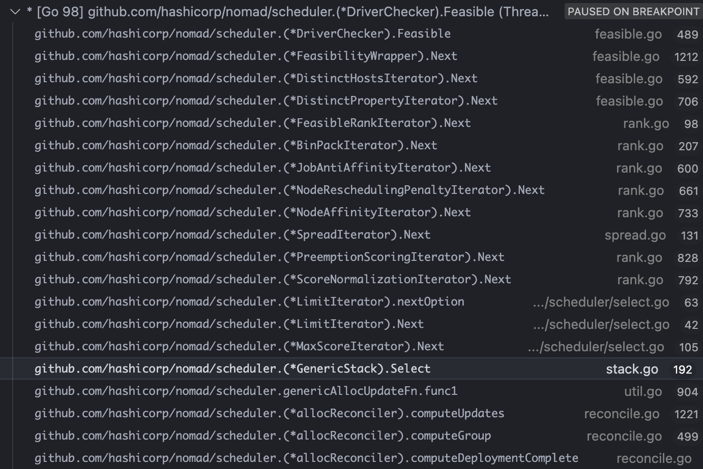
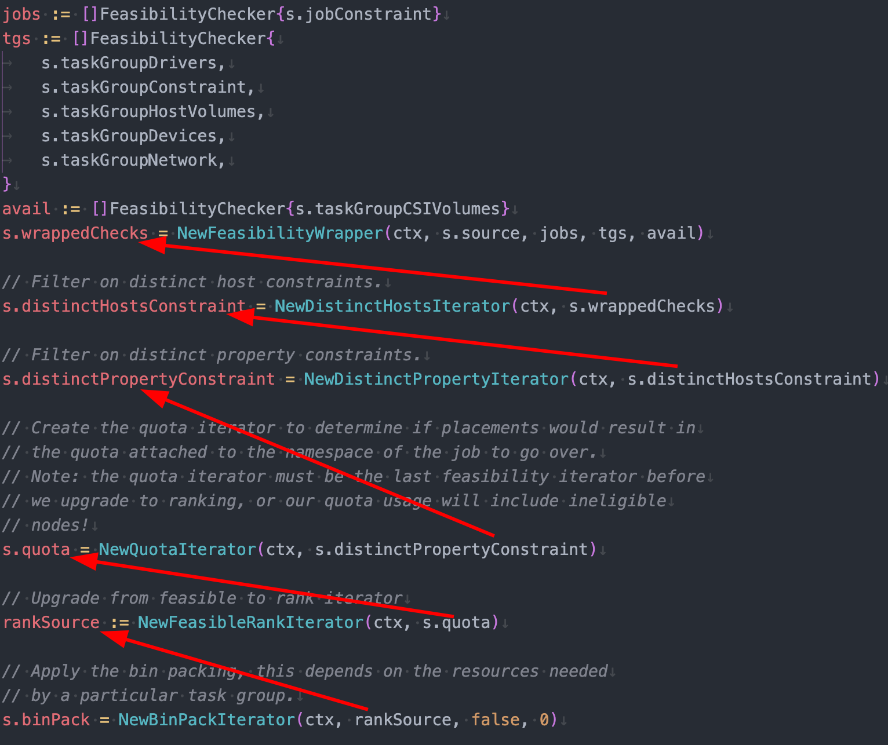

>Placing allocations is split into two distinct phases, feasibility checking and ranking. In the first phase the scheduler finds nodes that are feasible by filtering unhealthy nodes, those missing necessary drivers, and those failing the specified constraints.
>
>The second phase is ranking, where the scheduler scores feasible nodes to find the best fit. Scoring is primarily based on bin packing, which is used to optimize the resource utilization and density of applications, but is also augmented by affinity and anti-affinity rules. Nomad automatically applies a job anti-affinity rule which discourages colocating multiple instances of a task group. The combination of this anti-affinity and bin packing optimizes for density while reducing the probability of correlated failures.

## How does the scheduler finds nodes to start feasibility and ranking check?

Looking at the `GenericStack` struct used by Service scheduler, we see that there is `source` field.

```go
// GenericStack is the Stack used for the Generic scheduler. It is
// designed to make better placement decisions at the cost of performance.
type GenericStack struct {
	batch  bool
	ctx    Context
	source *StaticIterator
...
}
```

During scheduling process, at computing the placements for allocation, the available nodes are retrieved and set.

```go
// computePlacements computes placements for allocations. It is given the set of
// destructive updates to place and the set of new placements to place.
func (s *GenericScheduler) computePlacements(destructive, place []placementResult) error {
	// Get the base nodes
	nodes, byDC, err := s.setNodes(s.job)
	if err != nil {
		return err
	}

...

// setnodes updates the stack with the nodes that are ready for placement for
// the given job.
func (s *GenericScheduler) setNodes(job *structs.Job) ([]*structs.Node, map[string]int, error) {
	nodes, _, byDC, err := readyNodesInDCsAndPool(s.state, job.Datacenters, job.NodePool)
	if err != nil {
		return nil, nil, err
	}

	s.stack.SetNodes(nodes)
	return nodes, byDC, nil
}
```

The method `readyNodesInDCsAndPool` will retrieve all available nodes from in-memory MemDB, table `nodes`. Further filters will be applied to only get nodes that are `Ready`, e.g. no draining, no ineligibility.

```go
// Nodes returns an iterator over all the nodes
func (s *StateStore) Nodes(ws memdb.WatchSet) (memdb.ResultIterator, error) {
	txn := s.db.ReadTxn()

	// Walk the entire nodes table
	iter, err := txn.Get("nodes", "id")
	if err != nil {
		return nil, err
	}
	ws.Add(iter.WatchCh())
	return iter, nil
}
```

Now the `source` can iterate through the list of this nodes	and proceed further.

## Are we scanning through all nodes to make a decision? 😱

No, there's a limit function applied while iterating through the nodes 

```go
	// Apply a limit function. This is to avoid scanning *every* possible node.
	s.limit = NewLimitIterator(ctx, s.scoreNorm, 2, skipScoreThreshold, maxSkip)
```

## How feasibility and ranking checks are performed?

It starts with `Select` call in the scheduler, let's look at below call stack



Wow! there are lots of calls in format of some `Iterator.Next`, starts with `MaxScoreIterator` and ended with `Feasible` calls

These `Next` calls implemented this interface `RankIterator`

```go
// RankIterator is used to iteratively yield nodes along
// with ranking metadata. The iterators may manage some state for
// performance optimizations.
type RankIterator interface {
	// Next yields a ranked option or nil if exhausted
	Next() *RankedNode

	// Reset is invoked when an allocation has been placed
	// to reset any stale state.
	Reset()
}
```

Remember, `First phase: Feasibility, Second phase: Ranking`.

When the scheduler Stack is created, it is constructed carefully, by stacking ranking objects over feasibility objects, hence the name `Stack` duh. This is so that we go through all feasibility checks first and go to ranking next.



Look at this method [`NewGenericStack`](https://github.com/hashicorp/nomad/blob/f4c7182873e04a3bc219870c2e2452ab6ec4bc9a/scheduler/stack.go#L367-L462) for detail. While we travel along the path, we return early if there's exhausted check. E.g. this is ranking code for `JobAntiAffinity`

```go
func (iter *JobAntiAffinityIterator) Next() *RankedNode {
	for {
		option := iter.source.Next()
		if option == nil {
			return nil
		}
		// give ranking score based on job anti affinity here
```

The end result is a `Node` that is feasible and has highest ranking score.

```go
// MaxScoreIterator is a RankIterator used to return only a single result
// of the item with the highest score. This iterator will consume all of the
// possible inputs and only returns the highest ranking result.
type MaxScoreIterator struct {
	ctx    Context
	source RankIterator
	max    *RankedNode
}
```

## How is highest ranking score determined?

```go
func (iter *MaxScoreIterator) Next() *RankedNode {
	// Check if we've found the max, return nil
	if iter.max != nil {
		return nil
	}

	// Consume and determine the max
	for {
		option := iter.source.Next()
		if option == nil {
			return iter.max
		}

		if iter.max == nil || option.FinalScore > iter.max.FinalScore {
			iter.max = option
		}
	}
}
```

So we iterate through each node from the source, call feasibility and ranking checks, and store the node with highest `FinalScore`. 

## How many score nodes are we retaining?

It will be not wise if we score and keep track of all nodes score metadata.

A [heap](https://en.wikipedia.org/wiki/Heap_(data_structure)) is being used to keep track of `5` nodes with highest scores

```go
		// Create the heap if its not there already
		if a.topScores == nil {
			a.topScores = kheap.NewScoreHeap(MaxRetainedNodeScores)
		}
		heap.Push(a.topScores, a.nodeScoreMeta)
```


This is so beautiful! 🥹